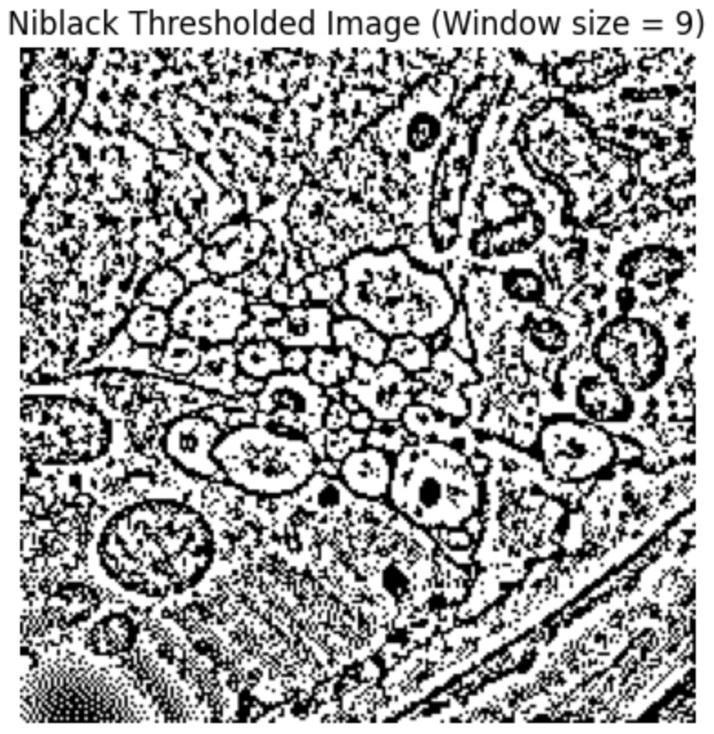

# Image-Thresholding

This project demonstrates **image thresholding** using **Otsu’s method** and **Niblack’s method** to separate foreground from background in grayscale images. 

---

## Steps Implemented

### 1. **Load and Visualize Input Image**
First, we load the grayscale image and show its histogram:

### 2. **Otsu's Method (Global Thresholding)**
- Iteratively evaluate each threshold value (0–255)
- Compute **intra-class variance** for background and foreground
- Select the threshold that minimizes intra-class variance (or maximizes inter-class variance)

We can see that the Optimal threshold in this project is 85:

We then apply binary thresholding using this optimal threshold, and get the below result:

---

### 3. **Niblack’s Method (Local/Adaptive Thresholding)**
- For each pixel, compute local mean and standard deviation within a sliding window (e.g., 25x25)
Threshold is computed as:  
`T(x, y) = μ(x, y) + k · σ(x, y)`  
where `μ` and `σ` are the local mean and standard deviation, and `k` is a constant (typically -0.2).

- Produces an adaptive binary mask based on local pixel statistics

We check the above function for 3 different window sizes, and plot thresholded binary images for different window sizesas below:

  
  
  

---

## Comparison

- **Otsu's Method** is effective when the image has a clear bimodal histogram.
- **Niblack's Method** works better for non-uniform lighting or textured backgrounds, as it adapts thresholds locally.

---
